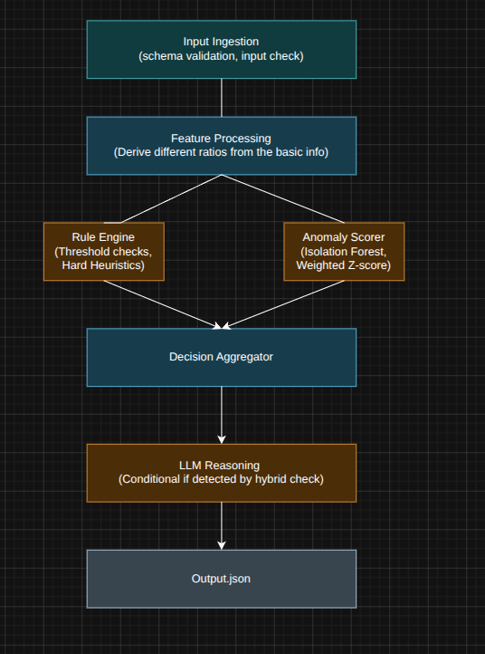

# SentelOps

An end-to-end anomaly detection pipeline for infrastructure-style resource metrics.



## To access the detailed docs, please refer the link below:
https://docs.google.com/document/d/1c3lNWLp6OgEyOW0SWC681Xy5AnupRdhokZJy82EwOAs/edit?usp=sharing

The pipeline:
1. Ingests payload data (or collects live local system/process metrics).
2. Scores each resource using a hybrid approach (rule engine + ML scorer).
3. Optionally enriches actionable anomalies with Gemini LLM explanations.
4. Writes results to `pipeline_output.json`.

## Project Structure

- `src/main.py`: Primary pipeline entrypoint.
- `src/utils/`: Payload validation, feature processing, rule engine, ML scorer.
- `src/llm/`: Gemini prompt building and system context tools.
- `src/models/`: Shared dataclasses for metrics, scoring, and LLM payloads.
- `src/config/`: Gemini configuration and environment variable handling.
- `src/rules/model/run.py`: Optional local script for quick ML scorer validation.
- `pipeline_output.json`: Pipeline output file generated by `src/main.py`.

## 1) Clone and Enter the Project

```bash
git clone <your-repo-url>
cd sentelops
```

## 2) Create and Activate a Virtual Environment

Linux/macOS:

```bash
python3 -m venv venv
source venv/bin/activate
```

## 3) Install Dependencies

This project does not currently include a `requirements.txt`, so install the required runtime packages directly:

```bash
pip install --upgrade pip
pip install psutil google-generativeai pandas
```

## 4) Optional: Configure Gemini API Key
To enable Gemini LLM enrichment for actionable anomalies, set the `GEMINI_API_KEY` environment variable with your API key.

## 5) Run the Pipeline Locally

From the project root:

```bash
python src/main.py
```

What this does by default:
- Collects a live local snapshot (host + top processes)
- Runs hybrid anomaly scoring
- Optionally calls Gemini (if key is configured)
- Writes output to `pipeline_output.json`

## Troubleshooting

- `ModuleNotFoundError: No module named 'psutil'`:
  - Install dependencies in the active virtual environment:
    - `pip install psutil google-generativeai pandas`

- `ValueError: Gemini API key is required...`:
  - Set `GEMINI_API_KEY` before running, or run without LLM enrichment.

- `python: command not found`:
  - Use `python3` on Linux/macOS.

- Virtual environment not activating:
  - Ensure you are in project root and shell execution policy permits activation (Windows PowerShell).

## Expected Output

After a successful run, you should see:
- Console summary containing `input_count`, `anomalies_found`, and `used_gemini`
- A generated/updated `pipeline_output.json` file with detailed per-resource output
